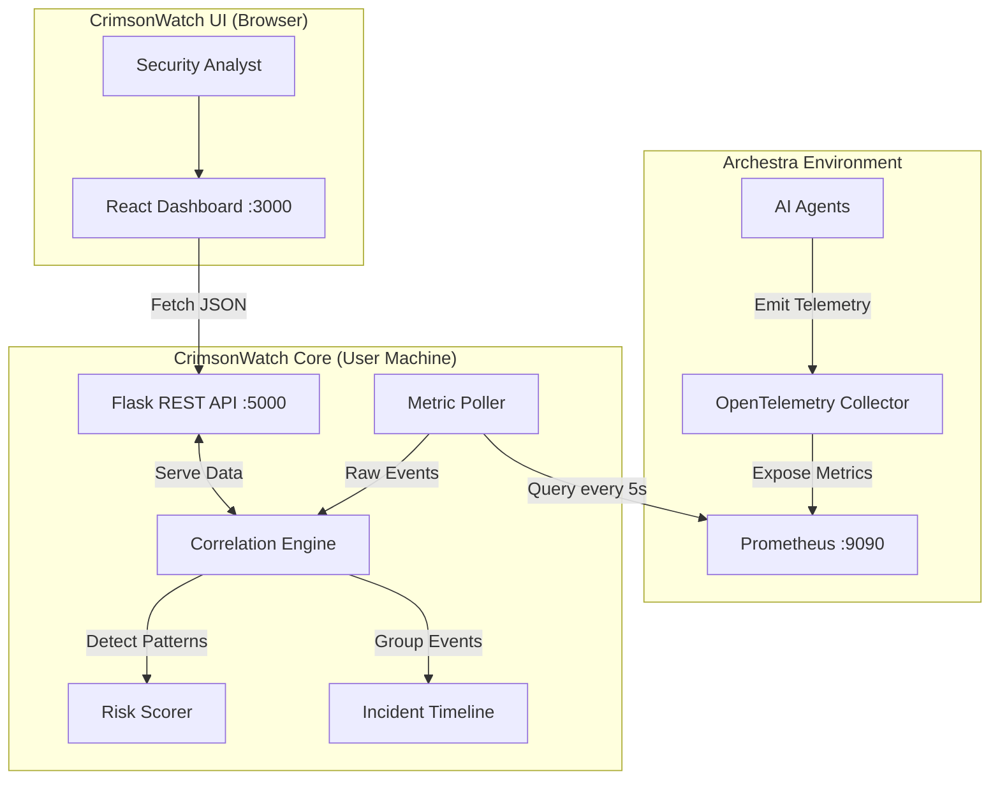

# Architecture Documentation

## System Overview

CrimsonWatch sits on top of the local Archestra environment. It does not interfere with the agents but "watches" them via the telemetry they emit.

## Data Flow
1.  **Ingestion**: Python script periodically hits `http://localhost:9090/api/v1/query`.
2.  **Normalization**: Raw Prometheus JSON is converted to internal `Event` objects.
3.  **Analysis**:
    -   Events are passed through a `RuleSet`.
    -   If a rule triggers, an `Incident` is created/updated.
    -   Global `ThreatLevel` is recalculated.
4.  **Presentation**: Frontend polls `/api/incidents` and `/api/metrics` to render the view.
